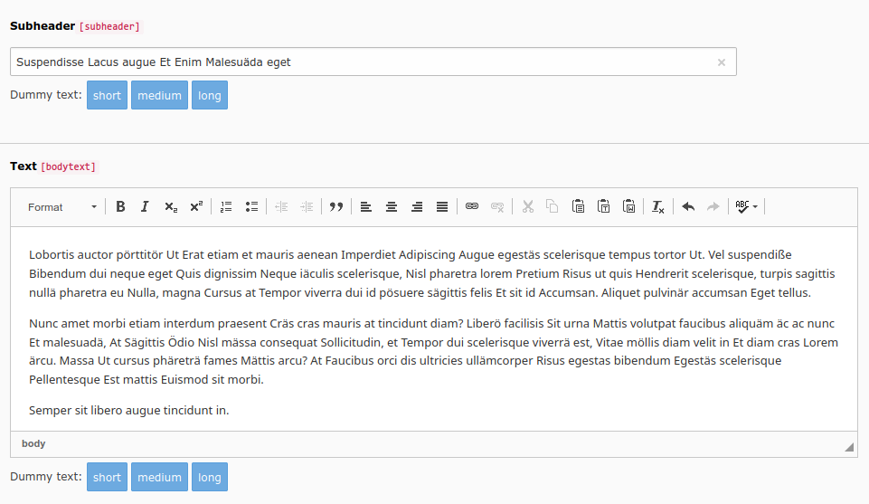

# Dummy Content TYPO3 Extension

This is a TYPO3 extension.

## What does it do?

With this extension an editor can quickly add some dummy text to pages and content with a click.

Buttons are added to a set of backend form fields like _title_, _header_, _bodytext_. A click on those buttons will
add dummy text to the form field.

## Installation

Install the extension by using composer and `composer req colorcube/dummy-content` or by downloading it in the extension
manager or on https://extensions.typo3.org/extension/dummy_content/.

Tested with TYPO3 v 9.5. Might work with 8 and 10.

## Usage

Click on the dummy text buttons to create texts with different length. The text replaces the current content.

## Languages

While the default dummy text is based on the well known 'Lorem ipsum', the generated text is modified to match the
currently edited language if possible. For Example in the german language the umlauts äöüß are added. Currently rules
for the following languages are available:

- german (de)
- french (fr)

Have a look into Resources/Public/JavaScript/LoremIpsum.js at `LoremIpsum.languages` how to add new languages.

## Configuration

Currently there's no way to configure the extension, but a developer can easily add the wizard buttons to other tables
and fields than the predefined.

Have a look in `Configuration/TCA/Overrides` and the way the TCA configuration is added to enable the wizard button.

## Todo

- check for compatibility with TYPO3 8 and 10
- add more configuration for common used content types like news or image captions
- would be nice to have a way to quickly add images like the old dummy_content extension did
- use different text for languages with non-ascii alphabets like russian

## Contribute

- Send pull requests to the repository. <https://github.com/colorcube/dummy_content>
- Use the issue tracker for feedback and discussions. <https://github.com/colorcube/dummy_content/issues>

